## why it exists

It is tricky to version control Google Colab notebooks.  
They are designed to be stored on Google Drive, but it is strongly discouraged to store a git folder on mounted cloud storage like Google Drive or OneDrive.  
This leads to a setup where Colab notebooks are stored outside a git location, which creates syncronization problems.  

Let's look closely at possible alternatives.  
1) The git repo folder is stored within a locally mounted Google Drive disk.  
    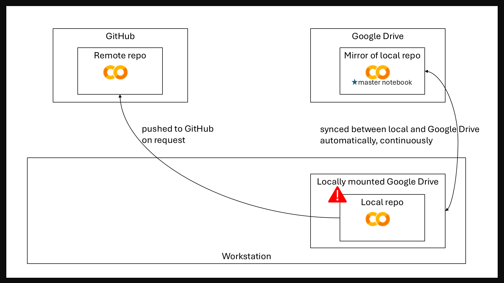  
    Downsides:  
    - Strongly discouraged as local git repository expects a fast local storage. The timing of Google Drive file syncronization is unpredictable and can interfere with the functionality of git.  
    - It might not be convenient to store the whole repository in Google Drive just because it has Colab notebooks.  
2) The git repo folder is stored on a fast local storage outside of Google Drive, while master Colab notebooks are stored in Google Drive. They are pushed into a single GitHub remote repo separately.  
    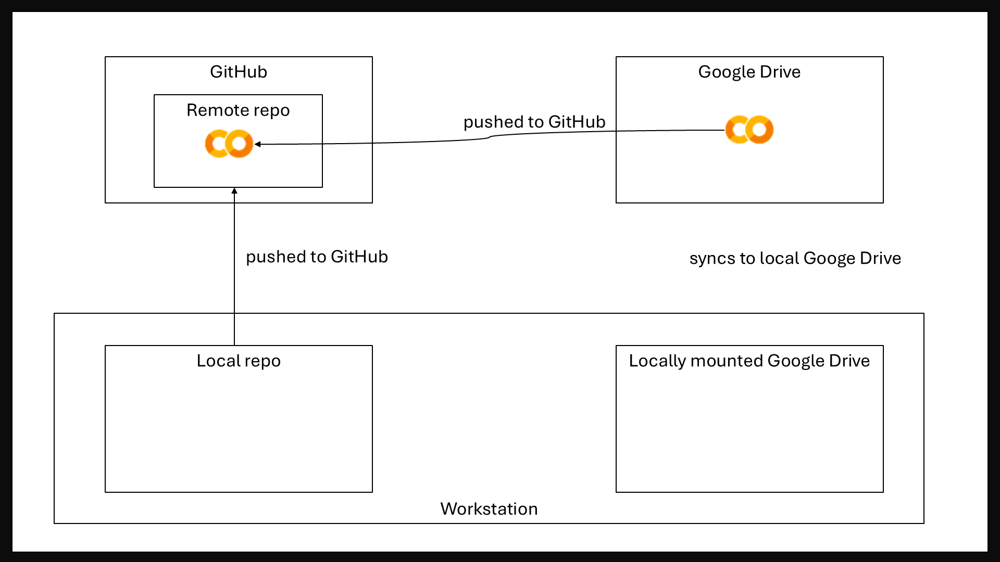  
    Downsides:  
    - Pushing Colab notebooks to GitHub is performed manually using "Save copy to GitHub" which extremely error-prone. A user has to choose the target repository manually and to enter the path to the notebook manually.  
    - A user has to manually remove cell outputs and run counts to prevent them from persisting in the repository.  
    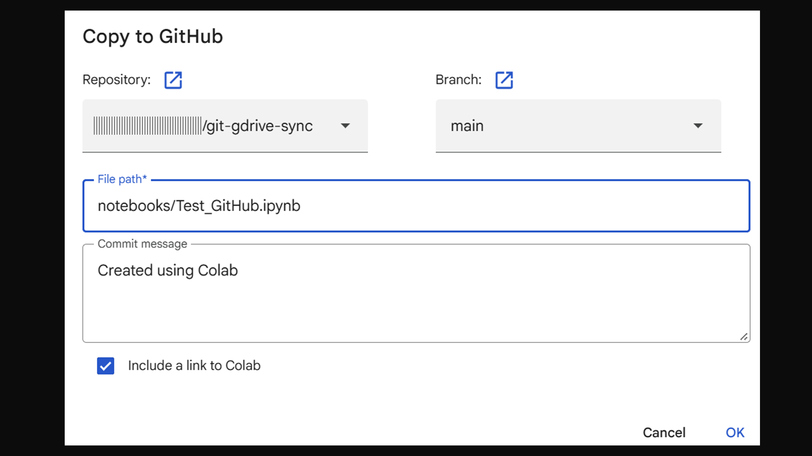  
3) The git repo folder is stored on a fast local storage outside of Google Drive, while master Colab notebooks are stored in GitHub.  
    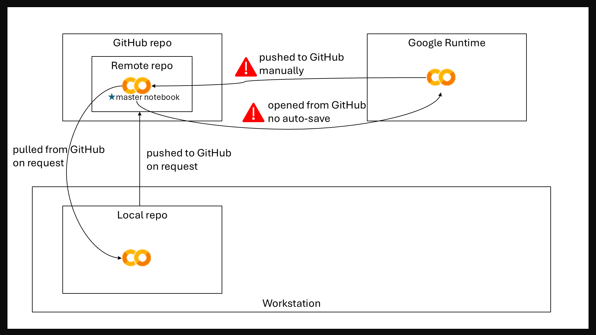  
    Downsides:    
    - Colab notebooks opened from GitHub are not autosaved directly. There is no possibility to save changes locally without committing to the GitHub repository.  
    - A user has to manually remove cell outputs and run counts to prevent them from persisting in the repository. 

This project proposes a solution in which:
- The git repo folder is stored on a fast local storage outside of Google Drive  
- Master Colab notebooks are stored in Google Drive  
- An automated process copies Colab notebooks from a locally mounted Google Drive to the git repo folder  
- An automated process strips cell outputs and run counts from the notebooks that have changed   
- All changes are reviewed and commited to GitHub from the local git repo folder  
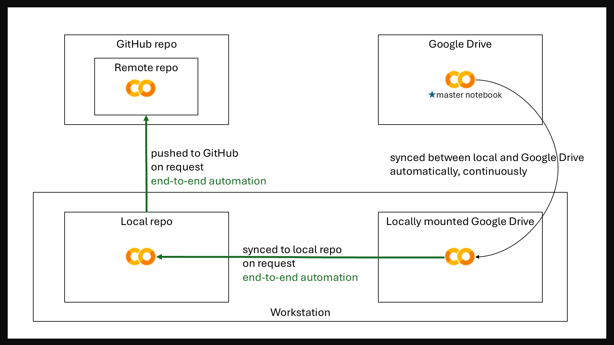  

## how it works

An example of the automated workflow which syncs the notebooks that have been changed, strips them of cell outputs, and pushes changes into git:  
1. The script mirrors the content of the source Google Drive directory into the target directory in a local file system.  
It identifies that two notebooks have been changed, and it removes cell outputs and run counts from the notebooks.  
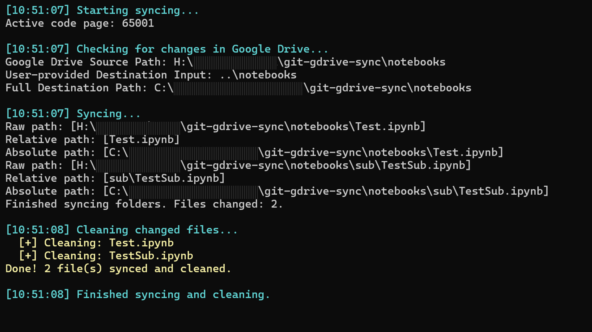  
  
2. The script locates the repo which contains the target directory with the notebooks.  
It runs ```git status``` on the repo and allows the user to choose the next action: add, commit, push, or interrupt execution.  
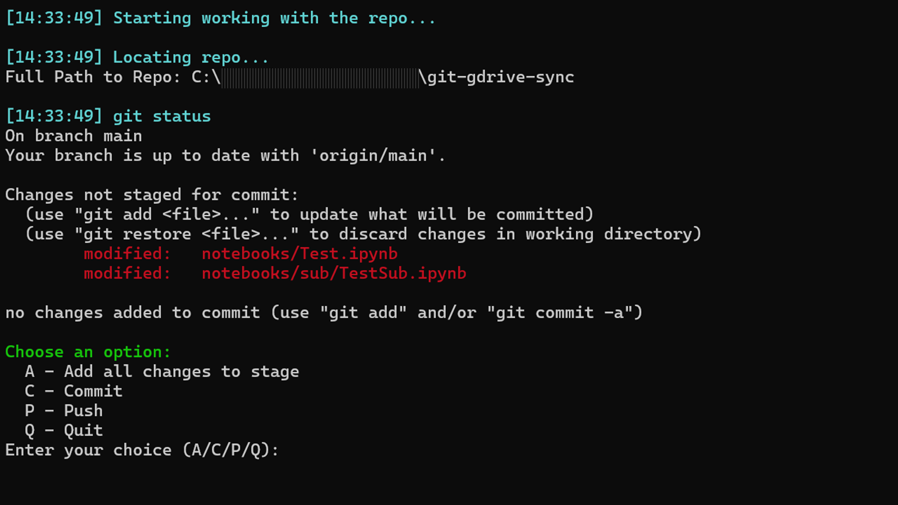  
  
3. If the user chooses to add changes to stage, the script runs ```git add -A```.  
It shows the updated repo status, and invites the user to confirm proceeding to committing.  
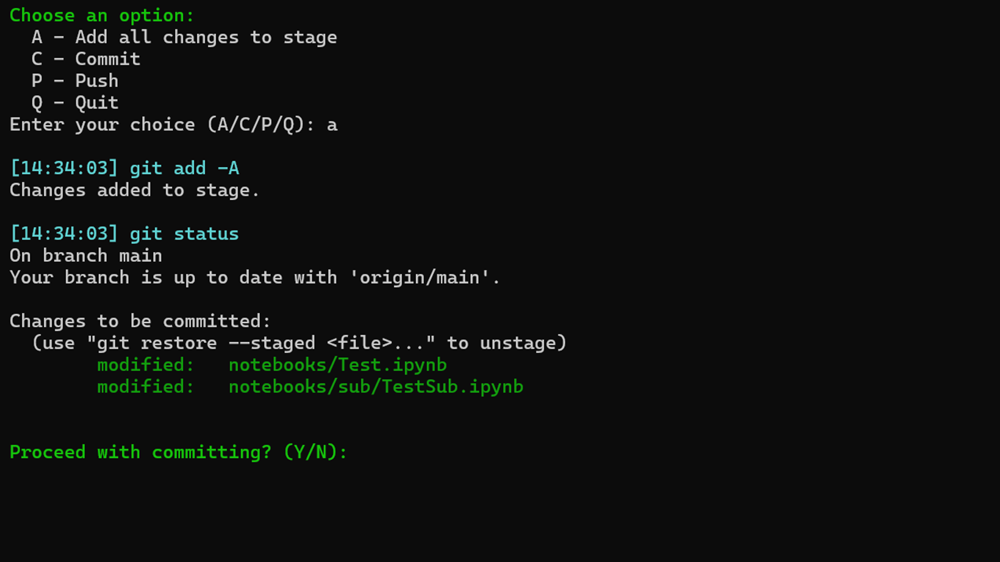  
  
4. If the user agrees to commit, the script gets the commit message from the user response.  
It runs ```git commit -m```, shows the updated repo status, and invites the user to confirm proceeding to pushing.  
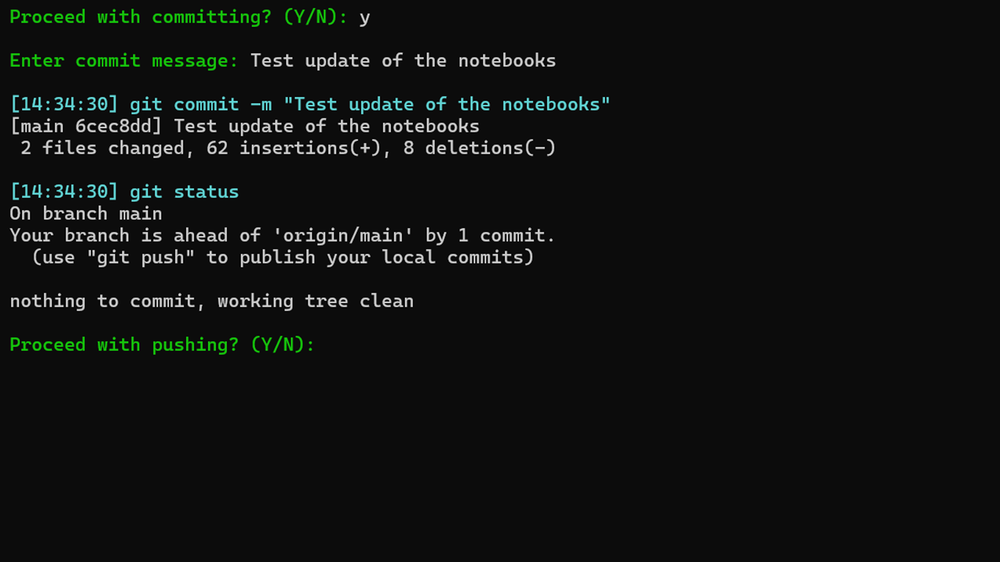  
  
5. If the user agrees to push, the script runs ```git push``` (or any command like ```git push origin/main```, specified in parameters).  
It shows the updated repo status, and asks the user if another iteration of reviewing the repository is needed.  
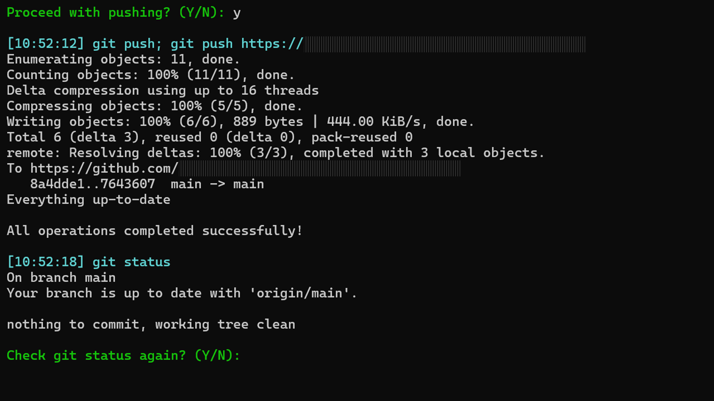  
  
6. If the user confirms, the process starts again from Step 2.  
If the user declines, the script exits.  
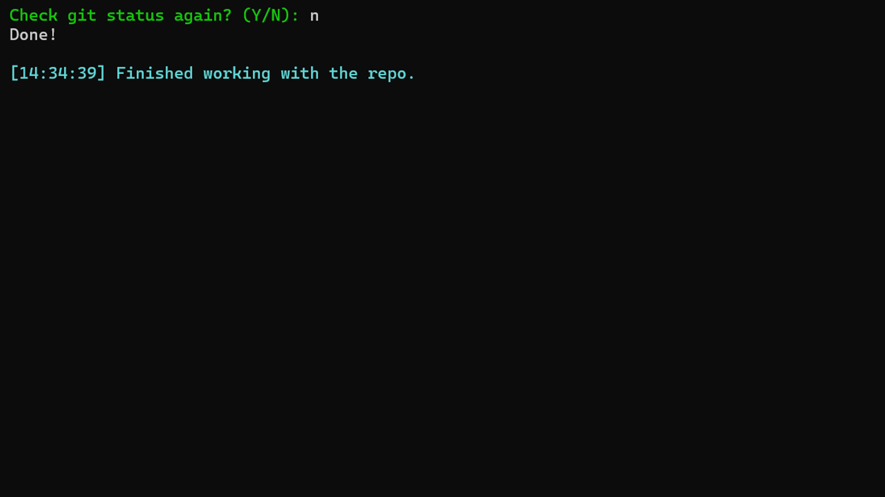  
  
  